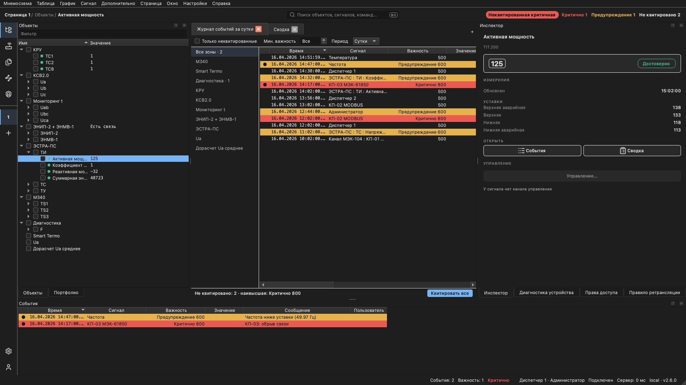
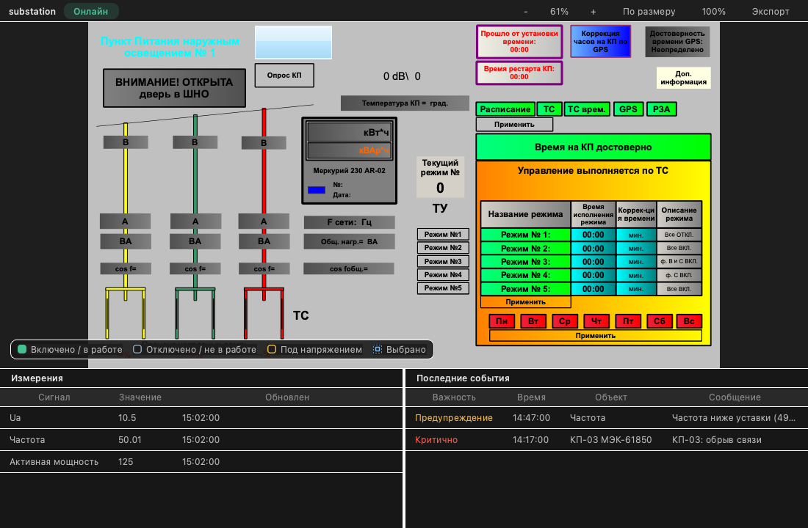
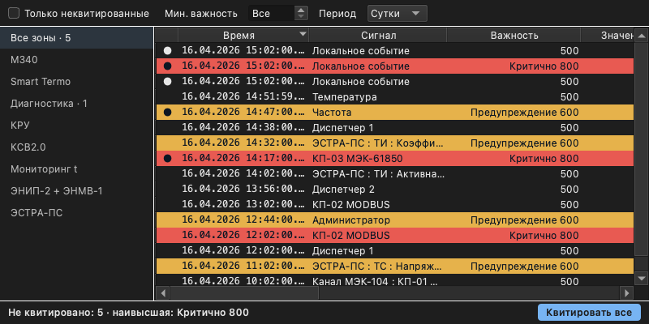
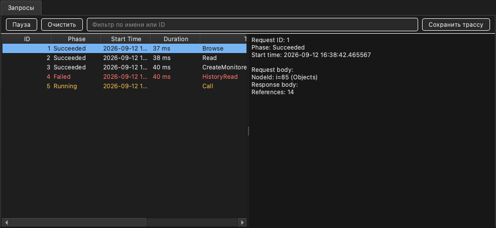

# Telecontrol SCADA Client

Desktop client for the Telecontrol SCADA system: real-time and historical
monitoring, alarm handling, and device configuration for industrial and
power-system installations. C++23 and Qt 6, on Windows and macOS.

**[Live demo](https://telecontrol-ru.github.io/scada/app/)** ·
**User manual** [English](https://telecontrol-ru.github.io/scada/en/) /
[Русский](https://telecontrol-ru.github.io/scada/) ·
**[Screen gallery](screenshots/)**



The operator workbench: object explorer, event journal with severity banding,
and the Inspector showing the selected signal's value, quality and setpoints.
The client follows the host OS light/dark preference — every screen below is
[captured in both appearances](screenshots/).

## Screens

| | |
|---|---|
| [](https://telecontrol-ru.github.io/scada/en/client/graph/) | [](https://telecontrol-ru.github.io/scada/en/client/display/) |
| **[Trends](https://telecontrol-ru.github.io/scada/en/client/graph/)** — stacked time-series panes with per-series min/max/mean and a shared time cursor. | **[Displays](https://telecontrol-ru.github.io/scada/en/client/display/)** — single-line schematics driven by live values. |
| [](https://telecontrol-ru.github.io/scada/en/client/events/) | [](https://telecontrol-ru.github.io/scada/en/client/debugger/) |
| **[Alarms and events](https://telecontrol-ru.github.io/scada/en/client/events/)** — severity-banded journal, filtered by zone, severity and period, with acknowledgment. | **[Protocol debugger](https://telecontrol-ru.github.io/scada/en/client/debugger/)** — every client↔server request traced with phase and duration. |

**[All 72 screens →](screenshots/)**

## What it does

- Browse the server's object model — devices, signals, and their live values
- Real-time and historical trends, with cursors, limits and CSV export
- Event and alarm journals, with acknowledgment and per-zone filtering
- Single-line displays and free-form tables built on the same data
- Device configuration: parameters, address maps, limits, bulk create
- Users, roles and password policy; an audit log of who changed what
- Per-device diagnostics, metrics, and a decoded protocol frame log
- Printing and print preview; user profiles with saved page layouts
- Russian and English UI

### Data service backends

Three are registered through the `REGISTER_DATA_SERVICES` macro, selected at
login:

| Backend | Protocol | Default address |
|---------|----------|-----------------|
| Scada | Telecontrol (gRPC) | `localhost` |
| OPC UA | OPC UA | `opc.tcp://localhost:4840` |
| Vidicon | Vidicon | `localhost` |

The servers those talk to speak IEC 60870-5-104, IEC 61850, Modbus and OPC UA
to the field. Modus 6.30 schematics are integrated on Windows through ActiveX.

## Trying it

The quickest look is the **[live demo](https://telecontrol-ru.github.io/scada/app/)**
— a shared instance you can sign into anonymously. That is the *web* client:
a browser implementation of the same workbench, the same vocabulary and the
same data, rendered in its own idiom rather than as a copy of this one.

**This repository does not build standalone yet.** The client resolves the
six products it consumes as sibling checkouts, and three of them are not
published:

| Consumed product | What it is | Public |
|---|---|---|
| [`scada-core`](https://github.com/alexsmn/scada-core) | base utilities, gRPC protocol, metrics | yes |
| [`scada-common`](https://github.com/alexsmn/scada-common) | address space, node services, OPC UA types | yes |
| [`opcuapp`](https://github.com/alexsmn/opcuapp) | OPC UA SDK | yes |
| `display` | the schematic display runtime | not yet |
| `graph_qt` | the charting widget | not yet |
| `view_manager_qt` | dockable view management | not yet |

So treat a clone as sources to read rather than a build to run — the CI here
is static analysis for the same reason. The build instructions below are the
real ones, and they work in a checkout that has all six.

## Building

```bash
cmake --preset ninja                 # Configure
cmake --build --preset release       # Build (or: debug, relwithdebinfo)
ctest --preset test-release          # Test (or: test-debug)
cmake --build --preset relwithdebinfo --target run   # Build and launch
```

Every product in the SCADA tree carries this same preset set, so the commands
do not change from one to the next. Export `VCPKG_ROOT` before configuring —
the preset names the vcpkg toolchain through it, and a toolchain file is read
before any project CMake runs, so nothing else can supply it. Everything else
machine-specific — ccache, cppcheck, and on Windows the MSVC include and lib
directories — lives in one `.scada-local.cmake` beside `build-support/`.

### Prerequisites

- A C++23 compiler (MSVC, Clang, or GCC)
- CMake 3.25+ with [vcpkg](https://vcpkg.io/)
- Qt 6 — `qtbase` (widgets), `qttools`, `qttranslations`; `qtactiveqt` on Windows
- Boost — Asio, Beast, Signals2, Algorithm, Range, JSON, Process, Program Options, Date Time, System
- GoogleTest
- Windows SDK / ATL, for the Windows-only COM and ActiveX modules

Those come from [`vcpkg.json`](vcpkg.json); the sibling products come from the
resolver in `build-support/`.

## CI

[`.github/workflows/ci.yml`](.github/workflows/ci.yml) runs **static analysis
only**, on push and pull request to `main` and `release/**`. There is no build
job: a public runner cannot assemble one while three consumed products are
unpublished, and it would also need a multi-hour Qt source build with no
binary cache. A build job returns when those products do.

The `analyze` job runs the same cppcheck configuration the local build runs,
against this repository's own `.cppcheck-suppressions`. It builds a pinned
cppcheck (2.21.0) from source rather than installing the distro package, which
is eight releases behind and disagrees with it in both directions. `error:`
findings gate the job; warnings are uploaded as an artifact.

## Project structure

```
scada-client/
├── app/           # Entry point and ClientApplication (qt/ holds main())
├── aui/           # Abstract UI layer: toolkit-free grid/tree/table models
├── base/          # Foundation utilities (command line, blinker, JSON, files)
├── clipboard/     # Clipboard and node serialization
├── controller/    # MVC controller layer, view management, command registry
├── core/          # Command registries, tracer, progress host
├── main_window/   # Window lifecycle, pages, docks, status bar
├── modules/       # 45 feature modules — see below
├── profile/       # User profiles, window definitions, page layouts
├── properties/    # Property management and dialogs
├── res/           # Resources and settings
├── resources/     # Command ids and icon-strip paths
├── screenshots/   # Generated screen gallery + image_manifest.json
├── services/      # Shared services (speech, tasks, telemetry)
├── test/          # Integration tests, shared fixtures, E2E
├── tools/         # Screenshot generator and source-only checks
├── ui/            # Shared widgets
└── web/           # Web component
```

`modules/` is where the features live — `graph`, `events`, `table`, `summary`,
`sheet`, `timed_data`, `portfolio`, `favorites`, `filesystem`, `print`,
`export`, `configuration`, `administration`, `debugger`,
`device_diagnostics`, `device_metrics`, `bulk_create`, `limits`, `login`,
`settings`, `inspector`, `transmission`, and the Windows-only `modus` and
`vidicon`, among others.

A module with UI keeps its toolkit-specific code in a `qt/` subdirectory and
its models in the module root, which is what keeps those models testable
without a `QApplication`. The `client_module()` CMake helper creates the
`<name>_qt` target for each one automatically.

## Architecture

Modular MVC with context-based dependency injection. Each module declares a
`*Context` struct of its dependencies and privately inherits from it, so what
a module needs is explicit rather than reached through globals:

```
main() → AppInit → ClientApplication → [CoreModule, EventModule, MainWindowModule, ...]
```

Async work is coroutine-first (`co_await` over Boost.Asio), with `promise<T>`
kept at older module boundaries.

## Command-line switches

| Switch | Description |
|--------|-------------|
| `--verbose-logging` | Enable verbose log output |
| `--log-service-read` | Log service read operations |
| `--log-service-browse` | Log service browse operations |
| `--log-service-history` | Log service history operations |
| `--log-service-event` | Log service events |
| `--log-service-model-change-event` | Log model change events |
| `--log-service-node-semantics-change-event` | Log node semantics change events |

## Screenshot generator

The [gallery](screenshots/) is rendered, not hand-captured: an offscreen Qt
build drives real windows from a JSON fixture, so a UI change lands as a
reviewable image diff. It builds as its own executable,
`client_screenshot_generator`, in [`tools/screenshot_generator/`](tools/screenshot_generator).

```bash
cmake --build --preset release --target client_screenshot_generator
cd build/ninja/bin/Release
QT_QPA_PLATFORM=offscreen ./client_screenshot_generator --out=path/to/output
```

`--out` is required, and `QT_QPA_PLATFORM=offscreen` is not optional on a
headless host. Nothing rebuilds the generator for you, so build it before
reading any change in its output as a regression.

| Option | Meaning |
|---|---|
| `--out=<dir>` | Output directory (required) |
| `--image-manifest=<path>` | Path to `screenshots/image_manifest.json` |
| `--data=<path>` | Fixture to drive, instead of the source tree's `screenshot_data.json` |
| `--only=<names>` | Comma/semicolon/newline-separated filenames to capture |
| `--theme=<name>` | Render under a design-token theme: `dark`, `light` or `hc` |

Anything but `--gtest_*` that is not in that table is rejected rather than
ignored. `--gtest_filter` selects among the `ScreenshotGenerator.*` captures;
`CaptureAllWindows` writes one PNG per window type and `CaptureMainWindow`
writes the composite workbench.

After regenerating, refresh the gallery index:

```bash
python3 screenshots/render_gallery.py --render
```

A bare `render_gallery.py` is the check that it is current, and runs as the
`client_screenshot_gallery_check` ctest.

## Documentation

The user manual — operator guides, device configuration, protocol notes — is
published bilingually at
**[telecontrol-ru.github.io/scada](https://telecontrol-ru.github.io/scada/)**
([English](https://telecontrol-ru.github.io/scada/en/)). Most of its UI images
are the captures in [`screenshots/`](screenshots/).

## License

GPL-3.0 — see [LICENSE](LICENSE). Third-party asset notices are in
[NOTICE](NOTICE).
