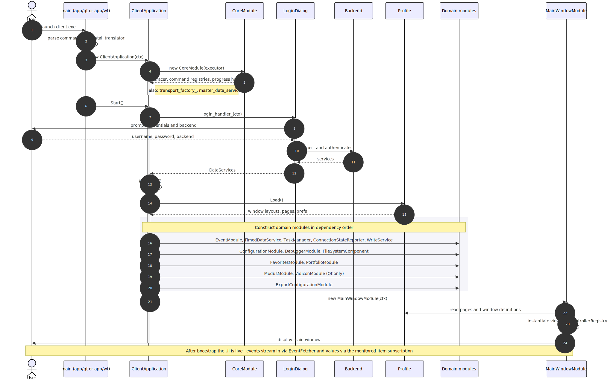

# Telecontrol SCADA Client — High-Level Design

> Status: living document. Captures the *current* shape of the client at the
> point of writing, not a forward-looking roadmap. The roadmap lives in
> `client/tasks.md`.
>
## 1. Purpose and Scope

The Telecontrol SCADA Client is the operator-facing application for the
Telecontrol industrial control system. It connects to a SCADA Server (or
to OPC UA / Vidicon back-ends) over the network, browses the device address
space, monitors live values, displays historical data, journals events, and
issues control commands.

This document describes:

- **Requirements source of truth** (§2)
- **High-level components** and how they fit together (§3)
- **Cross-cutting concerns** (§4)
- **Known limitations and open questions** (§5)

It does *not* describe individual screens, command-line switches, or build
instructions — those live in `README.md`, `command-line.md`, and the user
documentation site at <https://telecontrol-ru.github.io/scada/>.

## 2. Requirements

Use cases, functional requirements (FR-*), and non-functional requirements
(NFR-*) now live in [`requirements.md`](requirements.md). This design doc
focuses on the implementation architecture that satisfies those
requirements.

## 3. High-Level Components

The client decomposes into roughly the following layers. Each layer is a
small set of source directories with a single coherent purpose; layers
generally depend downward.

<p align="center">
  
</p>

> Source: [`architecture-layers.mmd`](architecture-layers.mmd). Regenerate
> with `mmdc -i architecture-layers.mmd -o architecture-layers.svg -b transparent`.

### 3.1 Application bootstrap — `app/`

`ClientApplication` is the top-level orchestrator. Its constructor accepts a
`ClientApplicationContext` (executor, login handler, optional service
overrides for tests) and instantiates every module in dependency order.
`Start()` returns a `promise<void>` that resolves when login completes and
the first profile page is displayed.

Two `main()` entry points exist:

- `app/qt/main.cpp` builds `client.exe`, the Qt 5 desktop client.
- `app/wt/main.cpp` builds the Wt web server that serves the same UI over
  HTTP.

Both entry points instantiate the same `ClientApplication`; the difference
is which executor/message-loop they hand it.

Also lives here: `app_init.{h,cpp}` (one-time GDI+ / ATL setup),
`screenshot_generator.cpp` (offline rendering harness for docs and tests),
and `client_application_unittest.cpp`.

#### Regenerating the doc screenshots

Most images under `scada-docs/img/` are produced by the offline
`client_screenshot_generator` (see FR-21). The source-of-truth for which images
are auto-generated vs. hand-maintained is
`client/docs/screenshots/image_manifest.json`;
tags there tell you whether a file is an `auto-view`, `auto-dialog`,
`auto-menu`, `auto-state`, or one of the `manual-*` / `obsolete`
categories.

To regenerate:

```batch
cmake --build --preset release-dev -t client_screenshot_generator
build\ninja-dev\bin\RelWithDebInfo\client_screenshot_generator.exe ^
  --out=C:\path\to\scada-docs\img ^
  --image-manifest=C:\tc\scada\client\docs\screenshots\image_manifest.json
```

On Unix-y shells it's `./client_screenshot_generator --out=... --image-manifest=...`.

`--out` is required for the generator. The build
POST_BUILD step points it at `client/docs/screenshots/`.
`--image-manifest` is optional and overrides the default
`client/docs/screenshots/image_manifest.json` lookup.

For the first docs rollout, prefer the top-level
`update-screenshots-dev` workflow preset:

```batch
cmake --workflow --preset update-screenshots-dev
```

It rebuilds `client_screenshot_generator` if needed, regenerates
`client/docs/screenshots/` through the target's POST_BUILD step, and
copies the current approved rollout subset into `scada-docs/img/`:
`client-login.png`, `client-retransmission.png`, `graph-cursor.png`,
and `users.png`.

To add a new auto-screenshot:

1. Register (or locate) a `WindowInfo` for the view in its component
   (`components/*/`, `main_window/`, etc.).
2. Add an entry to the `screenshots:` array in
   `app/screenshot_data.json` — `type` must match `WindowInfo::name`,
   `filename` matches the scada-docs filename from the manifest, and
   `width` / `height` match the docs image dimensions pixel-exact.
3. If the view needs fixture data (new nodes, timed values, events),
   extend the matching section of `screenshot_data.json`.
4. Add an entry to `client/docs/screenshots/image_manifest.json` with the
   right tag and the markdown page(s) that embed it.
5. Rebuild `client_screenshot_generator` and confirm the new file lands.

The full startup sequence — from `main()` through login to the first
visible page — looks like this:

<p align="center">
  
</p>

> Source: [`bootstrap-sequence.mmd`](bootstrap-sequence.mmd). Regenerate
> with `mmdc -i bootstrap-sequence.mmd -o bootstrap-sequence.svg -b transparent`.

The always-on cross-process Qt E2E test design for launching the real
`client.exe` against the real `server.exe` is documented separately in
[`e2e-client-server.md`](e2e-client-server.md).

### 3.2 Core orchestration — `core/`

Owns the singletons every other module needs: `Tracer` for observability,
`GlobalCommandRegistry` (main menu / toolbar), `SelectionCommandRegistry`
(context menu), and `ProgressHost` for showing async-task progress in the
UI.

### 3.3 Abstract UI layer — `aui/`

Qt-and-Wt-agnostic models and helpers. Tables, trees, grids, and the
`Translate()` shim live here. Platform-specific implementations live in
`aui/qt/` and `aui/wt/`. The `aui/test/` subdir provides `AppEnvironment`,
which is the per-test fixture for spinning up a bare `QApplication` (or
`WServer`).

### 3.4 Services — `services/` and `common/master_data_services`

Cross-cutting per-session services:

- `TaskManager` — queues async operations, reports progress.
- `ConnectionStateReporter` — polls the back-end, retries with backoff.
- `TimedDataService` — combines real-time and historical data behind one
  interface, used by graph/summary/timed-data views.
- `SpeechService` — text-to-speech for alarm notifications.
- `MetricService` (via `metrics/`) — collects per-operation latencies.

The actual data-service interfaces (`AttributeService`, `MonitoredItemService`,
`ViewService`, `HistoryService`, `SessionService`, `MethodService`,
`NodeManagementService`) come from `common/master_data_services.h` in
scada-common, and are wired up at login time from one of the three
registered back-ends:

- **Scada (Telecontrol)** — default; talks to a Telecontrol Server.
- **OPC UA** — `opc.tcp://localhost:4840` by default. The OPC UA back-end
  is implemented in `common/opcua/client_session.*` on top of the native
  UA Binary client stack under `common/opcua/binary/` (no external
  OPC UA SDK). See the `common/docs/opcua.md` design doc and the
  `common/docs/diagrams/opcua_binary_client_architecture.svg` architecture
  diagram.
- **Vidicon** — Vidicon-protocol endpoint.

Backends are registered statically via the `REGISTER_DATA_SERVICES` macro in
`client_application.cpp`.

### 3.5 Profile and persistence — `profile/`

`Profile` is the durable representation of "what this user sees on launch":
window bounds and state, page list, page contents (`WindowDefinition`s),
favourites, alarm colours, sound preferences, default time ranges,
`bad_value_color`, etc. It is loaded from JSON on startup and rewritten on
shutdown via `Profile::Save()`.

### 3.6 Domain modules

Each is a thin module that registers its windows, controllers, and commands
with the central registries. There are 12 of them today:

| Module | Source | Responsibility |
|---|---|---|
| `CoreModule` | `core/` | Registries, tracer, progress host (§3.2). |
| `MainWindowModule` | `main_window/` | Window/page lifecycle (§3.7). |
| `ConfigurationModule` | `configuration/` | Object tree, hardware tree, raw nodes view. |
| `EventModule` | `events/` | Event fetching, journaling, local error events. |
| `ExportConfigurationModule` | `export/configuration/` | Configuration snapshot export/import. |
| `CsvExportModule` | `export/csv/` | CSV export for tabular views. |
| `FavoritesModule` | `favorites/` | Favourite nodes. |
| `PortfolioModule` | `portfolio/` | Named groupings of favourites. |
| `DebuggerModule` | `components/debugger/` | Protocol-level request/response inspector. |
| `ModusModule` *(Qt only)* | `modus/` | Modus 6.30 ActiveX schematic embedding. |
| `VidiconModule` *(Qt only)* | `vidicon/` | Vidicon display embedding. |
| `WebModule` | `components/web/` | Embedded web view component. |

Modules' `*Context` structs make their dependencies explicit; `ClientApplication`
constructs them in an order that satisfies the graph:

<p align="center">
  
</p>

> Source: [`module-graph.mmd`](module-graph.mmd). Regenerate with
> `mmdc -i module-graph.mmd -o module-graph.svg -b transparent`.

### 3.7 Main window and view manager — `main_window/`

A `MainWindowManager` owns one or more `MainWindow` instances. Each main
window contains a stack of `Page` objects from the profile, and each page
hosts one or more `OpenedView`s laid out as docks and tab groups.

Important responsibilities:

- `OpenedView::GetWindowTitle()` runs the English `WindowInfo::title`
  through `Translate()` so localised builds resolve to the `.ts`
  translation.
- `EventDispatcher` drives the auto-show / auto-hide / flash / sound
  behaviour for incoming alarms.
- `view_manager_qt.cpp` / `view_manager_wt.cpp` adapt the platform-agnostic
  layout to Qt docks vs Wt panels.

### 3.8 Controllers and commands — `controller/`

`ControllerRegistry` maps a `command_id` to a `ControllerFactory`. New
windows are opened by looking up the controller for their `WindowInfo`
and invoking it with a `ControllerContext`. Static registration uses
`REGISTER_CONTROLLER(MyController, kFooWindowInfo)`; dynamic registration
goes through `ControllerRegistry::AddControllerFactory` and is used by
modules whose factories close over services from their context (see
`ConfigurationModule`).

Action commands (main menu, toolbar, page commands, selection commands)
are registered into `GlobalCommandRegistry` and `SelectionCommandRegistry`
from `core/`.

### 3.9 UI components — `components/`

Twenty self-contained component subdirectories, each describing a single
view type or dialog. Most define a `WindowInfo`, register a controller,
and split into `qt/` and `wt/` subdirs:

| Component | Purpose |
|---|---|
| `about/` | About-the-application dialog. |
| `change_password/` | Change-password dialog. |
| `create_service_item/` | Wizard for creating a single service node. |
| `debugger/` | Protocol request/response inspector. |
| `device_metrics/` | Per-device performance counters. |
| `limits/` | Edit alarm/warning thresholds for an analog item. |
| `login/` | Authentication dialog. |
| `multi_create/` | Bulk-create wizard for many nodes at once. |
| `node_properties/` | Properties grid for any selected node. |
| `node_table/` | Generic editable grid (Users, Formats, Simulation Signals, Historical Databases). |
| `select_item/` | Modal node picker. |
| `sheet/` | Spreadsheet-like view of cells bound to live values. |
| `summary/` | Aggregate (count / min / max / avg) summary view. |
| `table/` | Generic real-time + historical table view. |
| `time_range/` | Time-range picker dialog. |
| `timed_data/` | Time-series view (used by graph and tables). |
| `transmission/` | Re-transmission rules editor. |
| `watch/` | Live "watch list" of monitored values. |
| `web/` | Embedded web view. |
| `write/` | Write-value / control-command dialog. |

Other view-bearing modules (Graph, Event Journal, Configuration trees,
Favourites, File system, Modus, Vidicon) live outside `components/` because
they predate the components convention or are too large to fit it; the
plan in `tasks.md` is to keep extracting them.

### 3.10 Platform integrations — `modus/`, `vidicon/`

Both are Qt-only and Windows-only (`#if !defined(UI_WT)`).

- `modus/` wraps the Modus 6.30 ActiveX control. The Russian-language
  OLESTR parameter names (`"ключ_привязки"`, `"положение"`, `"уставки"`)
  are part of the external protocol and **must not be renamed**.
- `vidicon/` embeds the Vidicon display protocol via a `VidiconClient`
  that bridges Telecontrol's `TimedDataService` to the Vidicon side.

### 3.11 Filesystem, export, print, graph

- `filesystem/` — async file I/O wrapper with a local cache, used for
  uploads/downloads against the server-side file system.
- `export/configuration/` — configuration tree snapshot exporter and
  importer (binary format).
- `export/csv/` — CSV writer used by tables, summaries, and journals.
- `print/` — print preview and printing for any view that exposes a
  printable model.
- `graph/` — multi-pane time-series chart, built on top of the external
  `graph-qt` package.

## 4. Cross-Cutting Concerns

- **Dependency injection.** Every module takes a `*Context&&` and
  privately inherits from it; no global state beyond the static command
  and data-service registries.
- **Async / promise-based control flow.** Every I/O returns `promise<T>`
  from scada-core. The bootstrap chain in `ClientApplication::Start()` is
  itself a `.then()` ladder.
- **Localisation.** A single `Translate()` function (`aui/qt/translation_qt.cpp`)
  routes through `QCoreApplication::translate("", text)` to match the
  empty translation context that `lupdate` writes into the `.ts` files.
  English literals in code, Russian (and any future languages) in `.ts`.
- **Theming.** Default Qt style is Fusion (set in `app/qt/main.cpp`).
  Profile carries `bad_value_color`, `alarm_color`, and similar palette
  hints used by the views.
- **Error handling.** Background failures publish to `LocalEvents`, which
  surfaces them in the events panel as red entries; fatal errors throw
  exceptions that propagate up the promise chain to the executor and end
  up in the boost.log sink.
- **Permissions.** `WIN_REQUIRES_ADMIN` on `WindowInfo` is the front-line
  check; back-end services enforce again. The `change_password/` and
  `node_table/` (Users) components are the admin surface area.
- **Observability.** `Tracer` is created first by `CoreModule` and
  threaded through every other module; `MetricService` collects timings;
  `BoostLogMetricReporter` flushes them to the log on a periodic timer.

## 5. Known Limitations and Open Questions

These are observations worth flagging in any future maintenance or
roadmap discussion. They are *not* prescriptive — many are intentional.

- **Wt feature parity is partial.** Modus, Vidicon, and the Qt-only paths
  in some components are unavailable in the Wt build. There is no
  parity test that ensures both UIs render the same fixture.
- **Configuration export format is binary and undocumented in this repo.**
  The exact wire format is implicit in `export/configuration/`. A schema
  document or version negotiation would reduce the migration risk if the
  format changes.
- **OPC UA back-end uses an in-repo UA Binary client.** The client stack
  lives in `common/opcua/binary/` and speaks the OPC UA Part 6
  binary encoding directly; no external OPC UA SDK is linked into
  common/ or client/. `Basic256Sha256` sign-and-encrypt is a tracked
  follow-up; today's builds only support `SecurityPolicy=None`.
- **Classic OPC (COM) still depends on an external SDK.** `third_party/opc/`
  is pulled from outside this repo and feeds the Windows-only
  `scada_common_opc` module; an SDK upgrade is a coordinated effort.
- **No formal performance budget.** `TimedDataService` and the historical
  views can in principle load tens of thousands of points; there is no
  documented upper bound or a regression guard for either query latency
  or memory.
- **Translation coverage is one language.** Only `client_ru.ts` ships.
  Adding another language is a matter of running `lupdate` and shipping
  the new `.qm`, but the workflow is not documented end-to-end.
- **`promise<T>` and executor pinning are subtle.** Forgetting
  `BindPromiseExecutor` on a continuation can move work to the wrong
  thread without an obvious symptom. The `tasks.md` entry on dependency
  injection hints at moving toward a more declarative style.
- **A handful of view-bearing modules predate the `components/`
  convention** (Graph, Event Journal, Configuration trees, Favourites,
  File system) and live at the top level. Their layout is consistent but
  inhomogeneous with the components folder.
- **Mojibake remains a hazard for files with Cyrillic literals**
  whenever a tool round-trips them through UTF-8 without a BOM. The
  pattern of "English in source, Russian in `.ts`" should be the
  default for new code; existing files have been repaired but the
  underlying tooling risk remains.

---

*Source as of writing: client repo at the head of `main`; this document
should be updated alongside any change that adds a top-level module, a
new domain folder under `client/`, or a new data-service back-end.*
