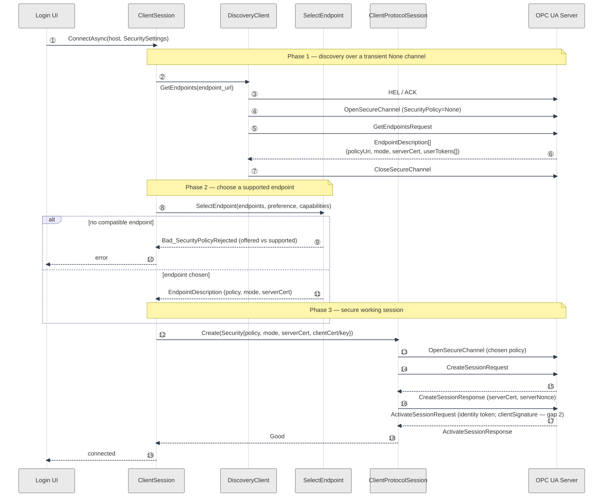

# OPC UA Client Interoperability — Gaps and Roadmap

## Scope

This document records what the Qt client (`client_qt` / `client.exe`) is
missing in order to connect to **arbitrary third-party OPC UA servers**
(Siemens S7-1500, Prosys, KEPware, open62541-with-security, cloud OPC UA
gateways, etc.), and lays out an implementation plan for the first and most
important gap: **`GetEndpoints` discovery and endpoint-driven security
selection**.

It is scoped to the *client* (initiator) side. The OPC UA *server* runtime
that ships in this repo (`common/opcua/server_*`) is out of scope except where
the client and server share wire codec / message types.

## Architecture recap

The Qt client talks to servers through a backend-neutral service interface
(`scada::DataServices`, `core/scada/data_services.h`). Two backends implement
it today:

| Backend | Factory | Transport |
| --- | --- | --- |
| `Scada` (proprietary) | `CreateRemoteServices` (`core/remote/remote_services.cpp`) | Protobuf-framed TCP (`SessionProxy`) |
| `OpcUa` | `opcua::CreateServices` (`common/opcua/services_factory.cpp:28`) | In-repo OPC UA Binary stack (`common/opcua/binary/`) |

The OPC UA backend is always compiled in (no build flag) and links
`scada_core_opcua_client`. The login dialog
(`client/modules/login/qt/login_dialog.ui`) lets the user pick the backend
(combo box, shown only when ≥2 backends are registered) and type an arbitrary
`opc.tcp://host:port`. So a user *can* point the client at a generic server
today — but the connection will fail against most production servers for the
reasons below.

The client adapter is `opcua::ClientSession` (`common/opcua/client_session.h`),
which implements all the `scada::*` service interfaces over the binary stack:

```
ClientSession            (scada::* service adapter)
  └─ ClientProtocolSession   (CreateSession / ActivateSession / Read / Browse / ...)
       └─ ClientChannel       (request-handle correlation)
            └─ ClientConnection
                 └─ ClientSecureChannel  (OPN handshake, symmetric framing)
                      └─ ClientTransport  (HEL/ACK, chunk framing, TCP)
```

## The connect flow today

`ClientSession::ConnectAsync` (`common/opcua/client_session.cpp:108-171`):

1. `ParseEndpointUrl` extracts **only host + port** from the
   `opc.tcp://host:port` string (`client_session.cpp:44`, `:114`). No security
   suffix, no path, no discovery URL handling.
2. Builds a TCP transport, then constructs the secure channel with the
   **single-argument (None-mode) constructor**:
   `secure_channel_ = std::make_unique<binary::ClientSecureChannel>(*transport_);`
   (`client_session.cpp:139`). There is **no code path that ever passes a
   `ClientSecureChannel::Security`** to the channel.
3. `ClientProtocolSession::Create` (`common/opcua/client_protocol_session.cpp:43`)
   runs `connection_.Open()` (HEL/ACK + OpenSecureChannel under
   SecurityPolicy=None) → `CreateSessionRequest` → `ActivateSessionRequest`.

So every OPC UA connection is hard-wired to **SecurityPolicy=None /
MessageSecurityMode=None / no discovery / no certificates**.

## Gap catalog

Severity reflects how often it blocks a real third-party server.

### CRITICAL — blocks most production servers

1. **No client-side `GetEndpoints` / discovery.** *(Resolved — see
   Implementation status below.)*
   The message types (`GetEndpointsRequest/Response`, `FindServers*`,
   `EndpointDescription`, `ApplicationDescription`, `UserTokenPolicy` in
   `common/opcua/message.h`), the binary **and** WebSocket codecs, and the
   server-side `HandleGetEndpoints`/`HandleFindServers` handlers
   (`common/opcua/server_runtime.cpp`) all already existed. What was missing was
   the **client** ever performing discovery: `ClientSession::ConnectAsync`
   connected straight to a hardcoded endpoint over SecurityPolicy=None and
   assumed the security configuration. A conformant client must call
   `GetEndpoints` first, read the server's `EndpointDescription[]`, and select a
   `(SecurityPolicyUri, MessageSecurityMode, UserTokenPolicy)` combination the
   server actually offers. **This document's implementation plan addresses this
   gap, and it has now been implemented.**

   > Note: an earlier revision of this document claimed these types "do not
   > exist anywhere in `common/opcua`". That was a tooling error (a BSD-`grep`
   > `\|` alternation that silently matched nothing); the codec and server side
   > were present all along.

2. **`ActivateSession` sends no client signature.** *(Resolved — see
   Implementation status.)*
   OPC UA Part 4 §5.6.3 requires the client to sign
   `serverCertificate || serverNonce` with its application private key in
   `ActivateSessionRequest.clientSignature`. The internal model previously had
   no signature field and sent an empty `SignatureData`. It now carries the
   signature: `ActivateSessionRequest` gained `client_signature_algorithm` /
   `client_signature`, `CreateSessionRequest` gained `client_certificate` /
   `client_nonce` (sent so the server can bind the key), `CreateSessionResponse`
   now captures the server certificate, and over a secured channel the client
   signs `serverCertificate || serverNonce` with RSA-PKCS#1-SHA256. Under
   SecurityPolicy=None the signature stays empty (correct). The signing
   primitive is unit-tested (sign + verify). The in-repo server now implements
   the Basic256Sha256 SecureChannel
   (`common/opcua/binary/secure_channel.cpp`), so the client OPN handshake and
   symmetric framing are exercised end-to-end against a real secured server in
   `common/opcua/binary/secure_channel_server_unittest.cpp`. The server also
   verifies the ActivateSession `clientSignature`, binds the client certificate
   to the SecureChannel certificate, and decrypts an RSA-OAEP encrypted
   UserNameIdentityToken password (`common/opcua/server_session_manager.cpp`).
   The server-side authentication-token surface is complete; authorization
   (access-level/permission enforcement) is a later workstream.

3. **Only `None` and `Basic256Sha256/SignAndEncrypt` security; no Sign-only.**
   `ClientSecureChannel` supports exactly two modes and explicitly does **not**
   implement Sign-only (`common/opcua/binary/client_secure_channel.h:30-31`:
   "Sign-only is not implemented…"). Missing: `Basic128Rsa15`,
   `Basic256Sha256/Sign`, `Aes128_Sha256_RsaOaep`, `Aes256_Sha256_RsaPss`.
   Many PLCs default to Sign-only or `Basic128Sha256`. Servers that refuse
   `None` (the common secure default) are unreachable unless they happen to
   offer exactly `Basic256Sha256/SignAndEncrypt` — which the in-repo server now
   does, so client↔server secured interop is covered.

### HIGH — blocks operator usability and large address spaces

4. **No security configuration in the UI.** *(Resolved — see Implementation
   status.)*
   `scada::SessionConnectParams` (`core/scada/session_service.h`) now carries a
   `SessionSecuritySettings security` block (mode, required policy URI, client
   cert/key paths) that the OPC UA backend honours, and the Qt login dialog now
   exposes a security-mode selector plus client certificate/key path fields
   (shown only for the OPC UA backend, persisted across sessions). Remaining UI
   work is cosmetic/secondary: file-picker browse buttons and the
   server-certificate trust UI of gap 5.

5. **Certificate management is partial.** *(Partially resolved — see
   Implementation status.)*
   The client now loads a client application instance certificate/key (from the
   login dialog's path fields, with file-picker browse buttons) and validates
   that the certificate the server returns in `CreateSession` matches the
   endpoint selected during discovery (MITM guard, OPC UA Part 4 §5.6.2). What
   remains is full server-certificate **trust** validation — chain / expiry /
   thumbprint against a configured trust list, plus the trust-list management
   UI and trust-on-first-use. Certificate *user* tokens are also still
   unsupported (gap 8).

6. **Multi-chunk receive resolved; send still single-chunk.** *(Receive
   resolved — see Implementation status.)*
   `ReadServiceResponse` now reassembles a response split across MessageChunks
   ('C'…'C''F') for both the None and Basic256Sha256 paths, with chunk-count and
   total-size caps and 'A'-abort handling, so large Browse/Read/History
   responses no longer truncate to their first chunk. Still open: the client
   never *sends* a multi-chunk request (a request larger than the negotiated
   send buffer fails), and `ExtraPaddingSize` (RSA padding > 255 bytes) is still
   not implemented on the secured send path.

### MEDIUM — interop correctness for non-default servers

7. **No `NamespaceArray` read / namespace remapping.** *(Foundation resolved —
   see Implementation status.)*
   The client now reads `Server_NamespaceArray` (`ns=0;i=2255`) after activation
   and exposes a `NamespaceTable` (index↔URI lookup) on the OPC UA session, so a
   server's namespace layout is known and a URI can be resolved to that server's
   index. What remains is wiring an actual *consumer* — e.g. remapping the
   NodeIds stored in saved profiles/pages by URI when reconnecting to a
   different server.

8. **User-identity tokens limited to Anonymous + plaintext UserName.**
   `ClientProtocolSession::Identity` is just optional `user_name` / `password`
   (`common/opcua/client_protocol_session.h:45-48`). No `X509IdentityToken`, no
   encryption of the password with the server certificate + user token policy
   (so UserName is unsafe except over an already-encrypted channel), no
   issued/JWT tokens, no `policyId` selection from the server's
   `UserTokenPolicy[]`.

### What already works (do not re-investigate)

HEL/ACK negotiation, OpenSecureChannel + token renewal/`Renew`
(`client_secure_channel.h:65`), CreateSession/ActivateSession round-trip,
`BrowseNext` continuation points, Publish/keepalive subscriptions, and
status-code decoding are implemented. Service coverage (Read/Write/Browse/Call/
MonitoredItems/NodeManagement) is complete for the simplified internal model.

## Suggested sequencing across all gaps

1. `GetEndpoints` discovery + endpoint-driven security selection — *this plan*.
   Prerequisite for everything else: you cannot pick a policy you cannot
   discover.
2. Real `ActivateSession` client-signature (gap 2) — unblocks strict servers
   even at `None`.
3. Sign-only + `Basic128Sha256` (gap 3) — covers most production policy
   defaults.
4. Security fields in `SessionConnectParams` + login UI + certificate trust
   management (gaps 4, 5).
5. Multi-chunk reassembly (gap 6) and `NamespaceArray` remapping (gap 7).

Gaps 1–3 live in `common/opcua/`; gaps 4–5 span the stack and the Qt login
module.

---

# Implementation plan: `GetEndpoints` + endpoint-driven security selection

## Implementation status

The client-side discovery + endpoint-driven security selection described below
is **implemented**, including the Qt login UI (M1–M6). New/changed code:

| Area | Files |
| --- | --- |
| Shared `opc.tcp://` URL parser | `common/opcua/endpoint_url.{h,cpp}` (and `ClientSession::ParseEndpointUrl` now delegates to it) |
| Discovery client (transient None channel → `GetEndpoints`) | `common/opcua/discovery_client.{h,cpp}` |
| Endpoint selector + client capabilities | `common/opcua/endpoint_selection.{h,cpp}` |
| DER certificate loader (server cert from endpoint) | `common/opcua/binary/crypto.{h,cpp}` — `LoadDerCertificate` |
| Security in the service contract | `core/scada/session_service.h` — `SessionSecuritySettings` on `SessionConnectParams` |
| Secure-connect wiring (discover → select → build Security → secure channel) | `common/opcua/client_session.{h,cpp}` — `DiscoverAndSelectEndpoint`, `BuildChannelSecurity`, `ConnectAsync` |
| Login UI security fields (mode + cert/key paths, OPC-UA-only, persisted) | `client/modules/login/login_controller.{h,cpp}`, `client/modules/login/qt/login_dialog.{h,cpp,ui}` |
| ActivateSession client signature (gap 2) | `common/opcua/binary/crypto.{h,cpp}` (`GenerateNonce`), `common/opcua/binary/client_secure_channel.{h,cpp}` (`SignClientData`), `common/opcua/server_session_manager.h` (struct fields), `common/opcua/binary/service_codec.cpp` (wire fields), `common/opcua/client_protocol_session.{h,cpp}` + `client_session.cpp` (signer wiring) |
| Server-certificate match validation (gap 5) | `common/opcua/client_protocol_session.{h,cpp}` (`ClientCredentials.expected_server_certificate` + CreateSession check), `client_session.cpp` (wires the endpoint cert), `binary/service_codec.cpp` (response encoder now emits the cert) |
| Login cert/key file-picker browse buttons (gap 5) | `client/modules/login/qt/login_dialog.{h,cpp,ui}` |
| NamespaceArray read + table (gap 7) | `common/opcua/namespace_table.{h,cpp}` (`NamespaceTable`), `common/opcua/client_session.{h,cpp}` (`ReadNamespaceArray` on connect + `namespace_table()` accessor) |
| Multi-chunk response reassembly (gap 6) | `common/opcua/binary/client_secure_channel.{h,cpp}` (`ReadServiceResponse` reassembly loop + `DecodeServiceMessageChunk`) |
| Tests | `endpoint_selection_unittest.cpp`, `discovery_client_unittest.cpp`, `client_session_secure_unittest.cpp`, shared fake `test/scripted_transport.h`; sign/verify in `client_secure_channel_unittest.cpp`; wire-field decode in `service_codec_unittest.cpp`; cert match/mismatch + multi-chunk reassembly in `binary/client_session_unittest.cpp`; `namespace_table_unittest.cpp` + connect-reads-namespace in `client_session_unittest.cpp` |

Verified: the full `scada_core_opcua_unittests` suite passes (253 tests,
including the new discovery/selection, sign/verify, wire-field,
server-certificate match/mismatch, NamespaceArray/`NamespaceTable`, and
multi-chunk reassembly tests);
`server` builds against the changed `session_service.h` and session structs;
and `client_qt` builds (AUTOUIC regenerates the new login widgets,
`login_controller.cpp`/`login_dialog.cpp` compile). The client↔server E2E suite
could not be exercised here — it requires an external signed license
(`SCADA_SERVER_LICENSE_FILE`) that is unavailable in this environment, so it
fails at setup before any login code runs, independent of this change.

Notes / deviations from the plan as written:

- **M1 was already done.** The discovery message types, the binary **and**
  WebSocket codecs, and the server-side `HandleGetEndpoints`/`HandleFindServers`
  handlers already existed; only the client-side call, selection, and wiring
  were missing. The "wire types + codec" milestone reduced to *using* them.
- **DiscoveryClient drives the request inline** through the connection's
  send/read API rather than the background `ClientChannel` read loop, so the
  transient channel's whole lifecycle stays on one coroutine frame with no
  detached reader outliving it.
- **`SessionConnectParams.security` is additive** (`mode` defaults to `None`),
  so the proprietary `Scada` backend and every existing call site are
  byte-for-byte unchanged; discovery only runs for `Auto`/`SignAndEncrypt`.
- **Selection failure returns `StatusCode::Bad`.** This enum has no
  `Bad_SecurityPolicyRejected`; the offered-vs-supported detail is intended for
  a log line (not yet emitted) rather than a distinct code.
- **Gap 2 (ActivateSession signature):** now implemented. `CreateSessionRequest`
  sends the client certificate + a fresh client nonce; `CreateSessionResponse`
  captures the server certificate; over a secured channel the client signs
  `serverCertificate || serverNonce` (RSA-PKCS#1-SHA256) and puts the
  `SignatureData` in `ActivateSessionRequest`. Empty under None. The signing
  primitive is unit-tested (sign + verify against the client cert's public key);
  full server-side validation needs a real secured server (untested here).
- **M6 (login UI):** a Security selector (No security / Most secure available /
  Sign and encrypt) plus client certificate and private-key path fields were
  added to the Qt login dialog. They are shown only for the OPC UA backend
  (`LoginController::IsSecuritySupported`), persisted via `SettingsStore`
  (`SecurityMode`, `ClientCertificate`, `ClientPrivateKey`), and mapped to
  `SessionConnectParams.security` in `LoginController::MakeSecuritySettings`.
  Deliberately minimal: the cert/key fields are plain path inputs (no file-picker
  browse button yet), and there is still no server-certificate **trust
  management** UI (gap 5) — an operator supplies paths but the client does not
  yet validate the server's certificate chain. The Wt login front-end was left
  unchanged (it has no backend/security selector) and keeps the default
  unsecured behaviour.
- **Gap 5 (certificate management), partial:** the client now loads its
  certificate/key (login dialog path fields + file-picker browse buttons) and
  rejects a `CreateSession` whose server certificate does not match the
  discovered endpoint's. Still open: full server-certificate **trust**
  validation (chain / expiry / thumbprint against a trust list), the trust-list
  management UI, and trust-on-first-use.
- **Gap 7 (NamespaceArray), foundation done:** the client reads
  `Server_NamespaceArray` on connect (best-effort, logged) and exposes a
  `NamespaceTable` for URI↔index lookup. Still open: an actual consumer that
  remaps stored NodeIds by URI (e.g. profile/page persistence) — none exists in
  the client today.
- **Gap 6 (multi-chunk), receive done:** `ReadServiceResponse` reassembles
  fragmented responses for both the None and Basic256Sha256 paths. Still open:
  multi-chunk *send* and `ExtraPaddingSize`.
- **Still open after this work:** the `Basic256Sha256/SignAndEncrypt` path is
  wired end-to-end but cannot be integration-tested here without a real secured
  server (the existing `client_secure_channel_unittest.cpp` covers the crypto);
  gap 3 (more security policies / Sign-only), the remainder of gap 5 (trust-list
  validation/UI), the send side of gap 6, gap 7's consumer wiring, and gap 8
  (certificate user tokens) remain.

## Goal

Before opening the working session, the client performs OPC UA discovery,
reads the server's offered endpoints, picks the best
`(SecurityPolicyUri, MessageSecurityMode, UserTokenPolicy)` for the operator's
intent, and then opens the real secure channel + session using that selection —
instead of hard-coding SecurityPolicy=None.

### Non-goals (handled by later work)

- Implementing *new* security policies (Sign-only, Basic128Sha256). This plan
  wires selection through the **existing** None and Basic256Sha256/SignAndEncrypt
  modes; selection of an unsupported policy yields a clear "unsupported
  security policy" error rather than a crash.
- `ActivateSession` client-signature (gap 2) — tracked separately, but this
  plan provisions the data it needs (server certificate + server nonce flow).
- Certificate trust-list UI — this plan adds the minimum
  certificate plumbing the secure path requires and surfaces validation
  results; full trust management is a follow-up.

## Design overview

OPC UA discovery is itself a session-less secure-channel exchange:

```
opc.tcp connect ─▶ HEL/ACK ─▶ OpenSecureChannel(None) ─▶ GetEndpointsRequest
        ◀─ EndpointDescription[] (each: endpointUrl, securityPolicyUri,
                                  securityMode, serverCertificate,
                                  userIdentityTokens[])
close channel ─▶ select endpoint ─▶ reconnect with chosen Security ─▶
        OpenSecureChannel(policy) ─▶ CreateSession ─▶ ActivateSession
```

`GetEndpoints` is always permitted over a SecurityPolicy=None channel by the
spec (Part 4 §5.4.4), even on servers that otherwise refuse None for sessions —
that is exactly why discovery is the entry point.



Source: `client/docs/opcua-discovery-flow.mmd`. Regenerate the SVG after editing
the source with `mmdr -i opcua-discovery-flow.mmd -o opcua-discovery-flow.svg`
(or `c:\tools\mmdr\mmdr.exe` on Windows); commit the `.mmd` and `.svg` together.

## Work breakdown

### 1. Wire types and codec (`common/opcua/`)

Add the discovery message types to the shared message model and binary codec,
following the existing patterns in `message.h` / `service_codec.cpp`. Per
`common/opcua/CLAUDE.md`, treat the OPC Foundation schema
(`https://files.opcfoundation.org/schemas/UA/1.04/Opc.Ua.Types.bsd.xml`) as the
source of truth for field order and encoding ids; reference the spec part in
comments.

New request/response structs (internal model, mirroring the simplified style
already used in `server_session_manager.h`):

- `GetEndpointsRequest { std::string endpoint_url; std::vector<std::string> profile_uris; }`
- `GetEndpointsResponse { scada::Status status; std::vector<EndpointDescription> endpoints; }`
- `EndpointDescription { std::string endpoint_url; scada::ByteString server_certificate;
   MessageSecurityMode security_mode; std::string security_policy_uri;
   std::vector<UserTokenPolicy> user_identity_tokens; std::uint32_t security_level; ... }`
- `UserTokenPolicy { std::string policy_id; UserTokenType token_type;
   std::string security_policy_uri; std::string issued_token_type; ... }`

Codec work in `service_codec.cpp`:

- Encode `GetEndpointsRequest` / decode `GetEndpointsResponse` with the correct
  encoding NodeIds (GetEndpoints request/response — verify the numeric ids
  against the schema before coding; do not hardcode from memory).
- Decode `EndpointDescription` (and its nested `ApplicationDescription` and
  `UserTokenPolicy[]`) — these are the new aggregate types.

Add round-trip unit tests in `service_codec_unittest.cpp` (encode→decode and
golden-bytes against a captured server response).

### 2. Discovery transport step (`common/opcua/binary/` + `client_session.cpp`)

Discovery needs a transient None-mode secure channel that is opened, used for
one `GetEndpoints` call, and closed — independent of the working channel.

- Add `ClientProtocolSession::GetEndpoints(std::string endpoint_url)` (or a
  small standalone `DiscoveryClient`) that drives:
  `ClientTransport` → `ClientSecureChannel` (None) → `connection_.Open()` →
  `GetEndpoints` call → `connection_.Close()`. This reuses the existing channel
  classes with no new crypto.
- Prefer a standalone `DiscoveryClient` over overloading `ClientProtocolSession`
  so the discovery channel lifecycle is clearly separate from the working
  session.

### 3. Endpoint selection policy

Add a pure, unit-testable selector:

```cpp
// common/opcua/endpoint_selection.h
struct SecurityPreference {
  // What the operator asked for. "Auto" picks the most secure endpoint the
  // client can actually speak.
  enum class Mode { Auto, None, SignAndEncrypt /* extend as policies land */ };
  Mode mode = Mode::Auto;
  std::optional<std::string> required_policy_uri;  // explicit override
};

// Returns the chosen EndpointDescription or a Bad status if nothing offered
// is supported by this client build.
scada::StatusOr<EndpointDescription> SelectEndpoint(
    const std::vector<EndpointDescription>& endpoints,
    const SecurityPreference& preference,
    const ClientCapabilities& capabilities);  // which policies/modes we support
```

Selection rules:

- Filter to endpoints whose `(security_policy_uri, security_mode)` is in
  `ClientCapabilities` (today: None, and Basic256Sha256/SignAndEncrypt).
- `Auto`: among supported, prefer the one with the highest effective security
  (SignAndEncrypt > Sign > None; tie-break on `security_level`).
- `None` / explicit override: pick the matching endpoint, else
  `Bad_SecurityPolicyRejected`.
- If nothing supported is offered, fail with a message listing what the server
  offered vs. what the client supports (actionable for the operator).

`ClientCapabilities` is derived from what `ClientSecureChannel` actually
implements, so as gap 3 lands new policies, selection picks them up by
extending one table.

Unit-test the selector exhaustively against synthetic endpoint lists — it is
pure data and the highest-value test target here.

### 4. Plumb security into the working connect path

- Extend `scada::SessionConnectParams` (`core/scada/session_service.h`) with an
  optional security block (keep existing fields; additive):
  ```cpp
  struct SecuritySettings {
    SecurityPreference preference;          // Auto by default
    std::optional<std::string> client_certificate_path;
    std::optional<std::string> client_private_key_path;
    bool trust_server_certificate_on_first_use = false;  // explicit opt-in
  };
  std::optional<SecuritySettings> security;  // nullopt => current None behavior
  ```
  Default (`nullopt`) preserves today's behavior, so the `Scada` backend and
  existing call sites are unaffected.
- In `ClientSession::ConnectAsync`, when `security` is present:
  1. Run discovery (`DiscoveryClient::GetEndpoints`) against the URL.
  2. `SelectEndpoint(...)`.
  3. Build a `ClientSecureChannel::Security` from the chosen endpoint
     (policy uri, mode, server certificate from the endpoint description,
     client cert/key loaded from the configured paths) and construct the secure
     channel with the **two-argument** constructor (`client_secure_channel.h:49`)
     instead of the None-only one at `client_session.cpp:139`.
  4. Proceed with `ClientProtocolSession::Create` as today.
- When `security` is `nullopt`, keep the exact current None path (one extra
  branch, zero behavior change).

### 5. Carry server certificate + nonce forward (provision for gap 2)

`SelectEndpoint` yields `server_certificate`; `OpenSecureChannel` already
exchanges nonces. Thread the server certificate (from the endpoint) and the
server nonce (from `CreateSessionResponse`, once that field is added) down to
`ClientProtocolSession::Create` so the follow-up gap-2 work can compute
`clientSignature` without re-plumbing. This plan does not compute the signature
yet, but it lands the data flow so gap 2 is a localized change.

### 6. UI (minimal, follow-up for full management)

Out of the critical path but needed for an operator to use a secure endpoint:

- Add to the login dialog (OPC UA backend only): a "Security" selector
  (Auto / None / Sign&Encrypt) and optional client-certificate file pickers,
  mapping to `SecuritySettings`.
- Surface discovery failures and "no compatible endpoint" errors with the
  server-offered vs. client-supported lists.

Wiring `SecuritySettings` through `LoginController` →
`SessionConnectParams.security` is the only controller change.

## Milestones

| # | Deliverable | Lands |
| --- | --- | --- |
| M1 | `GetEndpoints` wire types + codec + round-trip tests | `common/opcua/` |
| M2 | `DiscoveryClient` (None-channel GetEndpoints call) + tests | `common/opcua/` |
| M3 | `SelectEndpoint` pure selector + exhaustive unit tests | `common/opcua/` |
| M4 | `SessionConnectParams.security` + `ClientSession` secure connect path | `core/scada/`, `common/opcua/` |
| M5 | Server cert/nonce threaded for gap-2 readiness | `common/opcua/` |
| M6 | Login UI security selector + cert pickers | `client/modules/login/` |

M1–M4 deliver the headline capability (discover → select → connect securely
against the policies the client already implements). M5 de-risks gap 2. M6
makes it operator-usable.

## Testing strategy

- **Codec unit tests** (`service_codec_unittest.cpp`): encode/decode round-trip
  for `GetEndpointsRequest/Response`, `EndpointDescription`, `UserTokenPolicy`;
  plus golden bytes captured from a reference server.
- **Selector unit tests**: pure-function coverage of Auto / explicit / no-match
  / tie-break paths.
- **Discovery integration test**: point `DiscoveryClient` at the in-repo OPC UA
  Binary *server* (`common/opcua/binary/server.*`) and assert it returns at
  least the None endpoint; extend once the server advertises a secure endpoint.
- **Interop smoke (manual / CI-optional)**: run `GetEndpoints` against
  open62541's example server (offers None + Basic256Sha256) and assert the
  endpoint list parses and selection succeeds. Document the command in
  `client/docs/e2e-client-server.md` style.
- Follow the repo unit-test guidance: prefer wiring the real client stack and
  the in-repo server over mocks; the selector and codec are pure and need no
  fakes.

## Risks and notes

- **Encoding ids / field order**: the single biggest correctness risk is the
  binary layout of the new aggregate types. Verify every encoding NodeId and
  field against the OPC Foundation `.bsd` schema; do not transcribe ids from
  memory. The repo convention (`common/opcua/CLAUDE.md`) mandates this.
- **Discovery endpoint URL rewriting**: some servers return endpoint URLs with
  a hostname/IP differing from the one dialed (load balancers, multi-homed
  hosts). Decide a policy: trust the dialed host for the transport but use the
  returned `endpointUrl` in the `CreateSession`/`OpenSecureChannel` header (the
  spec ties the signed endpoint to the description). Note this explicitly in
  `DiscoveryClient`.
- **Additive only**: keep `SessionConnectParams.security` optional so the
  proprietary `Scada` backend and all existing connect call sites are
  untouched. The None path must remain byte-for-byte the current behavior when
  `security` is `nullopt`.
</content>
</invoke>
