# Telecontrol SCADA Client Requirements

> Status: living document. Captures the *current* requirements satisfied by
> the client at the point of writing, not a forward-looking roadmap. The
> roadmap lives in `client/tasks.md`.

## 1. Purpose and Scope

The Telecontrol SCADA Client is the operator-facing application for the
Telecontrol industrial control system. It connects to a SCADA Server (or
to OPC UA / Vidicon back-ends) over the network, browses the device address
space, monitors live values, displays historical data, journals events, and
issues control commands.

This document describes:

- **Use cases** the client supports today (§2)
- **Functional requirements** that follow from those use cases (§3)
- **Non-functional requirements** baked into the architecture (§4)

It does *not* describe individual screens, command-line switches, build
instructions, or high-level architecture. Those live in `README.md`,
`command-line.md`, `build.md`, `design.md`, and the user documentation site
at <https://telecontrol-ru.github.io/scada/>.

## 2. Use Cases

The client targets three actor archetypes — **operator** (read-mostly,
monitoring shifts), **engineer** (configures devices, exports data), and
**administrator** (manages users, system settings). The use cases below are
grouped into four areas — *monitoring & visualization*, *operator tools*,
*configuration*, and *administration* — and each is grounded in concrete
components in the source tree.

  

> Source: [`use-cases.mmd`](use-cases.mmd). Regenerate with
> `mmdc -i use-cases.mmd -o use-cases.svg -b transparent`.

The table that follows expands each use case with the source folder
that implements it. The columns are read as: identifier, actor, goal,
implementation.

| # | Actor | Use case | Source |
|---|---|---|---|
| UC-1 | Operator | Monitor live values from devices on the configured object tree, with periodic refresh and quality/limit indicators. | `components/watch/`, `components/timed_data/` |
| UC-2 | Operator | Visualise multiple time-series on a single chart with configurable time range, panes, colours, dots/steps, and legends. | `graph/`, `components/timed_data/` |
| UC-3 | Operator | View tabular real-time and historical data with sorting, filtering, and limit highlighting. | `components/table/`, `components/sheet/`, `components/summary/` |
| UC-4 | Operator | Receive and acknowledge events / alarms, with auto-flash, sound, and severity-based colour. | `events/`, `components/watch/` |
| UC-5 | Operator | Browse historical event journals over a chosen time range, filter by severity / item / area. | `events/event_module.cpp` (`EventJournal` window) |
| UC-6 | Operator | Watch a custom user-defined spreadsheet of cells bound to live values. | `components/sheet/` |
| UC-7 | Operator | Issue control commands (write set-points, switch states) with optional two-stage confirmation. | `components/write/` |
| UC-8 | Operator | Track favourite nodes for fast navigation, organise them into portfolios. | `favorites/`, `portfolio/` |
| UC-9 | Operator | Print or export the contents of the active view (table, graph, summary, journal). | `print/`, `export/csv/` |
| UC-10 | Operator | Locate, transfer and view files exchanged with the server (file system view, file cache). | `filesystem/`, `components/web/` |
| UC-11 | Operator | View Modus 6.30 schematics with click-to-navigate hot-spots overlaid with live values. *(Qt / Windows only)* | `modus/`, `vidicon/display/` |
| UC-12 | Engineer | Browse the device hardware tree, edit per-device parameters, set limits and aliases. | `configuration/devices/`, `components/limits/`, `components/node_properties/` |
| UC-13 | Engineer | Create and delete data items in bulk via multi-create dialogs and the table editor. | `components/multi_create/`, `components/node_table/` |
| UC-14 | Engineer | Export a configuration snapshot to disk, edit it externally, and import it back. | `export/configuration/` |
| UC-15 | Engineer | Inspect raw protocol traffic for a connected device (request / response inspector). | `components/debugger/`, `components/device_metrics/` |
| UC-16 | Engineer | Save the current window layout as a personal profile and restore it on next launch. | `profile/`, `main_window/` |
| UC-17 | Administrator | Authenticate with username / password against a chosen back-end (Scada, OPC UA, Vidicon). | `components/login/`, `app/client_application.cpp` |
| UC-18 | Administrator | Manage users, change passwords, set access rights. | `components/change_password/`, `components/node_table/` (`Users` window) |
| UC-19 | Administrator | Configure data transmission rules between sources and destinations. | `components/transmission/` |

The client also exposes a few cross-cutting capabilities that are not user
goals on their own but are worth listing as separate use cases because they
have explicit modules behind them:

| # | Use case | Source |
|---|---|---|
| UC-20 | Operate the same UI in either a Qt 5 desktop window **or** a Wt web page from a browser, against the same back-end. | `app/qt/`, `app/wt/`, `aui/` |
| UC-21 | Operate the UI in Russian (currently the only shipped translation). | `aui/qt/translation_qt.cpp`, `app/qt/client_ru.ts`, etc. |

## 3. Functional Requirements

Numbered for traceability. Each requirement cites the module that satisfies
it today.

### Data plane

- **FR-1.** Speak to **at least three pluggable back-ends**: native Telecontrol/SCADA, OPC UA, and Vidicon. Each back-end supplies the same set of services (attribute, monitored item, view/browse, history, session, method, node management). — `app/client_application.cpp:77-90` (`REGISTER_DATA_SERVICES`).
- **FR-2.** Browse the OPC-UA-style address space, expose hierarchical node trees with lazy fetching and progress reporting. — `configuration/`, `node_service_progress_tracker.{h,cpp}`.
- **FR-3.** Read attribute values either on demand or via long-lived subscriptions (monitored items). — `components/watch/`, `aui/models/`.
- **FR-4.** Read historical samples for any node over a user-chosen time range, with cancellation support. — `components/timed_data/`, history service via `master_data_services.h`.
- **FR-5.** Write values back to nodes (control commands, set-points, manual entry) with optional two-stage confirmation. — `components/write/`.
- **FR-6.** Receive event/alarm streams, store them in a journal, allow filtering, and acknowledge. — `events/event_module.cpp`, `events/event_fetcher.h`.
- **FR-7.** Detect connection loss and reconnect with backoff, surface connection state to the UI. — `services/connection_state_reporter.{h,cpp}`.

### Presentation

- **FR-8.** Render a configurable **multi-window, multi-page** layout. A user has one or more main windows, each with one or more named pages, each containing one or more docked or tabbed views. — `main_window/`, `profile/page.h`, `profile/window_definition.h`.
- **FR-9.** Provide ~20 reusable **view types**: graph, table, summary, sheet, watch, event journal, file system, debugger, device metrics, parameters, transmission, write, table editor, users, formats, simulation signals, historical databases, web, and a few others. Each is a `components/<name>/` module that registers a `WindowInfo` and a controller factory. — `components/`.
- **FR-10.** Persist user **profile** (window layouts, page definitions, favourites, colour preferences, alarm settings) to disk and restore it on next launch. — `profile/profile.{h,cpp}`.
- **FR-11.** Bookmark frequently used nodes and group them into named **portfolios**. — `favorites/`, `portfolio/`.
- **FR-12.** Print the active view (table, graph, summary, …) with print preview. — `print/`.
- **FR-13.** Export tabular data to **CSV** and the configuration tree to a **portable file format** that can be re-imported. — `export/csv/`, `export/configuration/`.

### Authentication and access control

- **FR-14.** Prompt the user for credentials at startup (or on disconnect), pass them to the chosen back-end, and store the resulting session. — `components/login/`, `OnLoginCompleted` in `client_application.cpp`.
- **FR-15.** Support **password change** through the UI. — `components/change_password/`.
- **FR-16.** Gate views and commands by user permission. Window definitions carry a `WIN_REQUIRES_ADMIN` flag that hides them from non-admins. — `controller/window_info.h`.

### Localization and theming

- **FR-17.** Render the entire UI in **Russian**. The translation lookup goes through a single `Translate()` shim that uses the empty Qt translation context to match `lupdate`-generated `.ts` files. — `aui/qt/translation_qt.cpp`, `app/qt/client_ru.ts`, `main_window/qt/main_window_ru.ts`.
- **FR-18.** Default to a consistent visual style (Fusion Qt style) with configurable alarm and bad-value colours stored in the profile. — `app/qt/installed_style.h`, `profile/profile.h`.

### Platform-specific integrations

- **FR-19.** Embed **Modus 6.30** schematics via ActiveX, exposing live values on top of static drawings, with click-to-navigate. *Qt + Windows only.* — `modus/libmodus/`, `modus/activex/`.
- **FR-20.** Embed the **Vidicon** display protocol for sites running mixed Telecontrol + Vidicon stacks. *Qt + Windows only.* — `vidicon/display/`, `vidicon/teleclient/`.

### Tooling and operations

- **FR-21.** Expose an offline **screenshot generator** that loads a JSON fixture and renders every window type to PNG, used both for documentation and for visual regression testing. — `app/screenshot_generator.cpp`.
- **FR-22.** Emit metrics and traces about itself for centralised observability. — `core/core_module.h` (`Tracer`), `metrics/boost_log_metric_reporter.h`.
- **FR-23.** Read run-time options from the command line (verbose logging, per-service logging toggles, locale override). — `command-line.md`, `base/program_options.{h,cpp}`.

## 4. Non-Functional Requirements

- **NFR-1. Modularity by dependency injection.** Every subsystem follows the *Context struct + private inheritance* pattern (`Module(ModuleContext&&)`). Modules are constructed in `ClientApplication` with explicit dependencies; there are no hidden globals beyond the registered backends and command registries. *(See CLAUDE.md §"Module-Based MVC".)*
- **NFR-2. Async-first I/O.** All I/O calls return `promise<T>` (from scada-core's `promise.hpp`). Continuations are pinned to the originating executor with `BindPromiseExecutor` so UI thread affinity is preserved. Internally, hot paths are migrating to C++20 coroutines using the shared `AwaitPromise`/`ToPromise` adapters in `core/base/awaitable_promise.h`; the public boundary stays `promise<T>` while the implementation body uses `co_await` for readable sequencing. Migrated so far: `ClientApplication::Start`/`Login`/`Quit`, the Qt application startup chain and E2E smoke/report helpers, screenshot-generator and ClientApplication Qt test wait helpers, `TaskManagerImpl` task bodies, `FileManagerImpl::DownloadFileFromServer`, `OpenFileCommandImpl::{Execute,OpenFile}` together with `OpenJsonFileAsync` and `AddFileAsync`, `EventView::SelectSeverity`, device metrics recursive node collection / compatibility wrappers and window-definition building, CSV export command and Qt parameter-dialog result flows, graph horizontal-range history reads, clipboard recursive paste/copy helpers, node property initial fetch/update, Qt time range and modal dialog result completion, resource error dialog handling, the properties child-definition and transport edit/dialog result flows, and the outbound OPC UA `opcua::ClientSession`. See `docs/coroutine_migration_plan.md`. — used pervasively; see `client_application.cpp` start sequence.
- **NFR-3. Dual UI on a shared model layer.** The application is built twice: once linked against Qt 5 (`*_qt` targets, `app/qt/main.cpp`) and once against Wt (`*_wt` targets, `app/wt/main.cpp`). Models live in module roots and are platform-agnostic; Qt-specific implementations live in `qt/` subdirs, Wt-specific in `wt/`. The `UI_WT` macro guards Modus and Vidicon, which are Qt-only. — `client_module.cmake`.
- **NFR-4. Cross-platform builds.** Windows (MSVC) and Linux (GCC, Clang) are first-class CI targets via the CMake presets. Dependencies are managed by vcpkg. — `vcpkg.json`, `.github/workflows/cmake-multi-platform.yml`.
- **NFR-5. Testability without a server.** Each module ships with `*_unittest.cpp` files using GoogleTest; tests use `TestExecutor` for deterministic async, and a set of in-memory local services (`scada::Local{Attribute,View,History,…}Service`) lets the screenshot generator and tests run with no real network. — `aui/test/`, `common/address_space/local_*` in scada-common.
- **NFR-6. Resilient connections.** Loss of the back-end is recovered with exponential-backoff reconnect rather than aborting; the UI keeps running and surfaces connection state to the user. — `services/connection_state_reporter.{h,cpp}`.
- **NFR-7. Bounded destruction order.** `ClientApplication`'s destructor releases modules in a specific order to respect the dependency graph; this is documented as a maintenance constraint. *(CLAUDE.md §"Destruction order matters".)*
- **NFR-8. Observability built in.** A `Tracer` instance is created in the core module before anything else and threaded through every operation; metrics are reported via `BoostLogMetricReporter` on a recurring schedule. — `core/core_module.h`, `metrics/`.
- **NFR-9. Localisation-aware.** All user-visible strings flow through `Translate()` (or `tr()` in `.ui` files) so the same binary supports any locale that has a `client_<lang>.qm` shipped next to the executable.
- **NFR-10. Backwards-compatible profile format.** Profiles are JSON, written through `profile/window_definition_util.cpp` with explicit field names so older profiles keep loading after schema additions.
- **NFR-11. UTF-8 source files where Cyrillic appears.** C++ files containing Cyrillic `u"..."` literals must carry a UTF-8 BOM so MSVC parses them under UTF-8 rather than the system code page. *(See `feedback_translation_bug.md` and the recent mojibake repair commits.)*

---

*Source as of writing: client repo at the head of `main`; this document
should be updated alongside any change that adds, removes, or materially
changes a user-facing capability, back-end, profile contract, or
non-functional architecture constraint.*
