# Screen gallery

72 captures of the Telecontrol SCADA client, rendered offscreen from a fixture by [`client_screenshot_generator`](../tools/screenshot_generator) and tracked in this repository — so a UI change lands as a reviewable image diff rather than being noticed the next time somebody refreshes the manual.

Each capture is rendered in both appearances. The client follows the host OS light/dark preference by default, so both are what operators actually see. The previews below are the dark render; the light one is linked beside it.

> Generated by [`render_gallery.py`](render_gallery.py) from [`image_manifest.json`](image_manifest.json) — edit those, not this file.

## Views

Workspace views and panels — what the operator works in. (50)

| Capture | Preview | |
|---|---|---|
| **Admin formats** `admin-formats.png` | 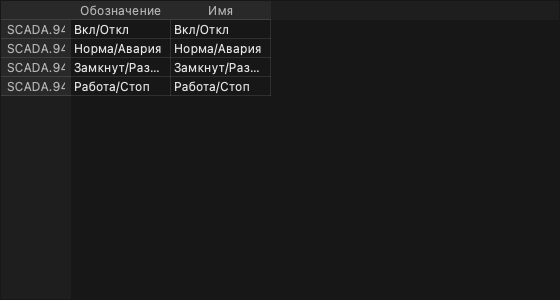 | [Light](admin-formats-light.png) |
| **Admin historical dbs** `admin-historical-dbs.png` | 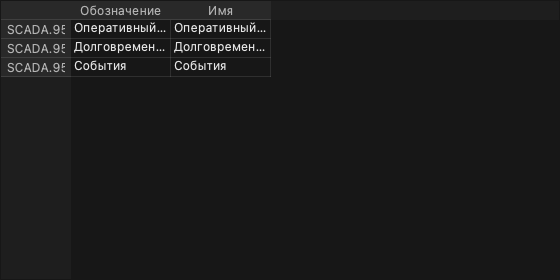 | [Light](admin-historical-dbs-light.png) |
| **Admin simulation** `admin-simulation.png` | 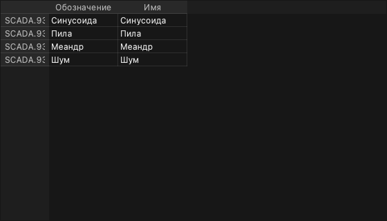 | [Light](admin-simulation-light.png) |
| **Administration explorer** `administration-explorer.png` | 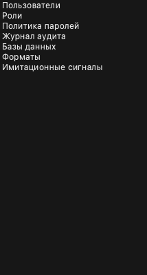 | [Light](administration-explorer-light.png) |
| **Audit log** `audit-log.png` | 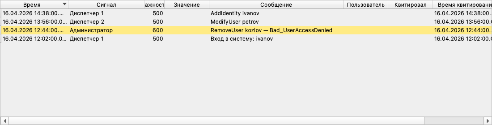 | [Light](audit-log-light.png) |
| **Breadcrumb** `breadcrumb.png` | 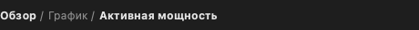 | [Light](breadcrumb-light.png) |
| **Bulk create** `bulk-create.png` | 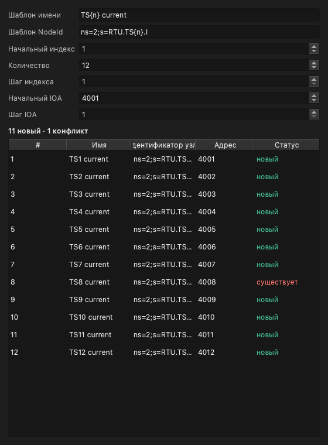 | [Light](bulk-create-light.png) [Manual](https://telecontrol-ru.github.io/scada/en/dev/data-items/) |
| **Client retransmission** `client-retransmission.png` | 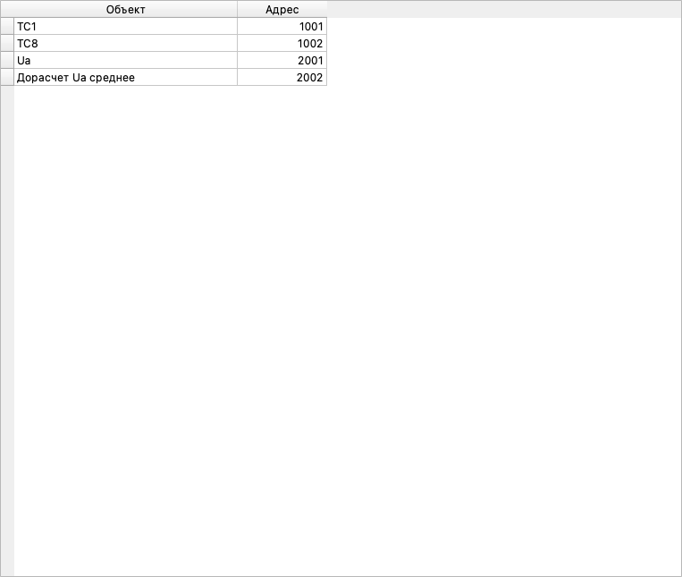 | [Light](client-retransmission-light.png) [Manual](https://telecontrol-ru.github.io/scada/en/client/) |
| **Command field** `command-field.png` |  | [Light](command-field-light.png) |
| **Config address map** `config-address-map.png` | 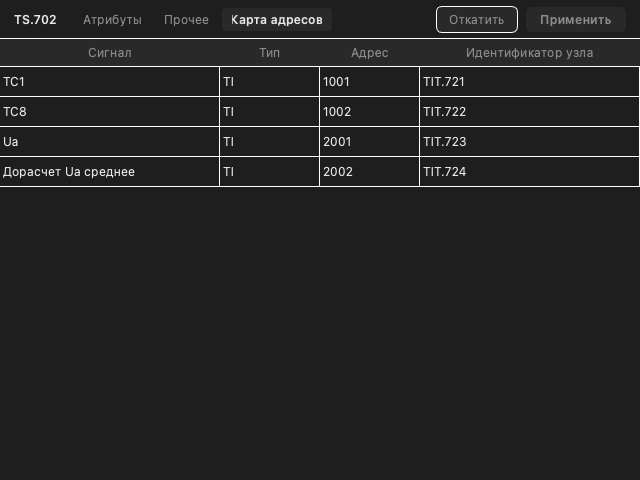 | [Light](config-address-map-light.png) |
| **Config limits** `config-limits.png` | 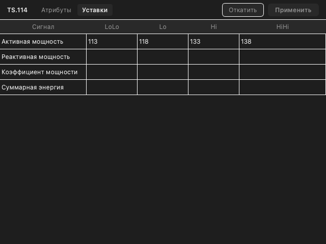 | [Light](config-limits-light.png) |
| **Config parameters** `config-parameters.png` | 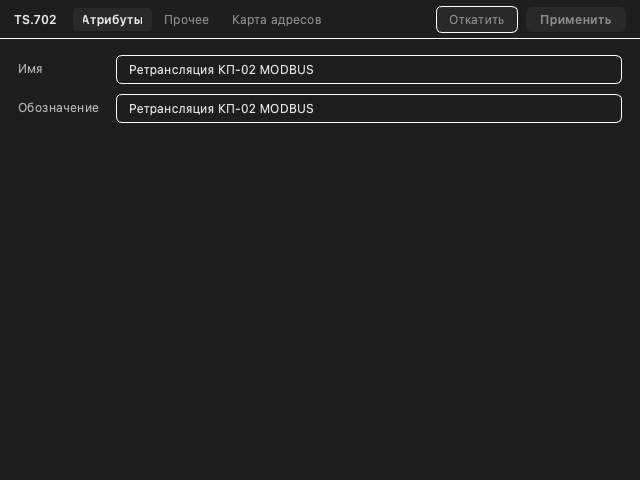 | [Light](config-parameters-light.png) |
| **Data** `data.png` | 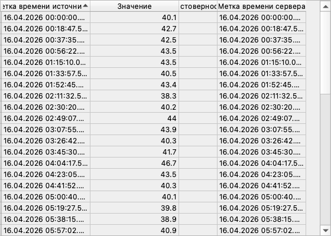 | [Light](data-light.png) |
| **Debugger** `debugger.png` |  | [Light](debugger-light.png) |
| **Device diagnostics** `device-diagnostics.png` | 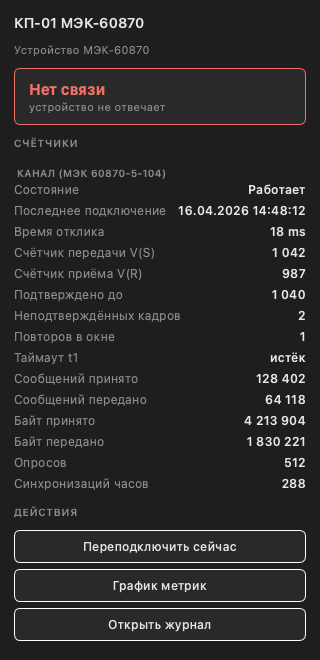 | [Light](device-diagnostics-light.png) |
| **Device metrics** `device-metrics.png` | 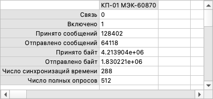 | [Light](device-metrics-light.png) [Manual](https://telecontrol-ru.github.io/scada/en/client/) |
| **Device watch** `device-watch.png` | 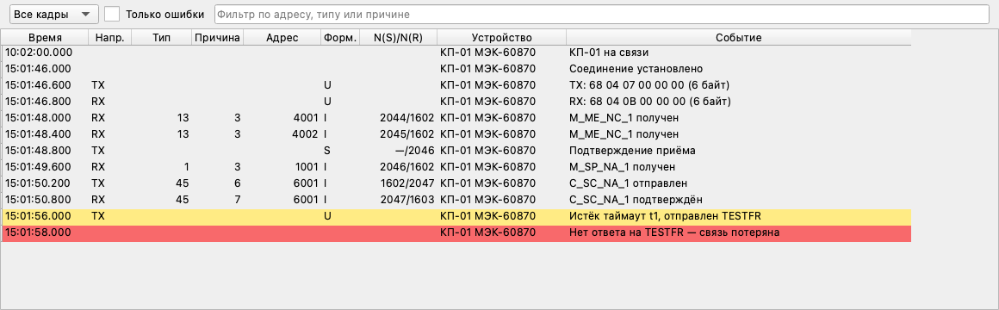 | [Light](device-watch-light.png) [Manual](https://telecontrol-ru.github.io/scada/en/client/device-watch/) |
| **Devices** `devices.png` | 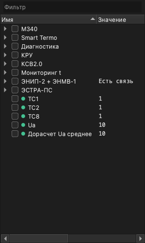 | [Light](devices-light.png) [Manual](https://telecontrol-ru.github.io/scada/en/client/) |
| **Events alarm surface** `events-alarm-surface.png` |  | [Light](events-alarm-surface-light.png) [Manual](https://telecontrol-ru.github.io/scada/en/client/workbench/) |
| **Events** `events.png` | 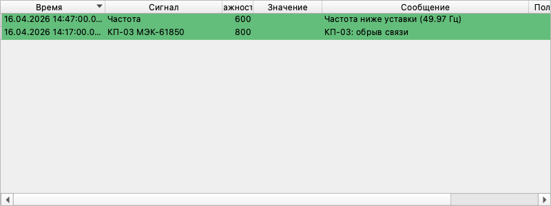 | [Light](events-light.png) |
| **Favorites** `favorites.png` | 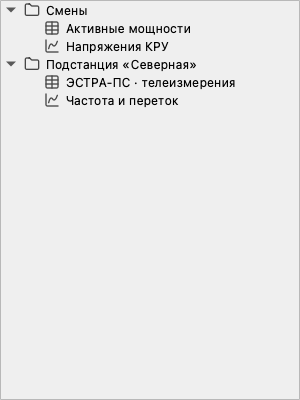 | [Light](favorites-light.png) |
| **Files** `files.png` | 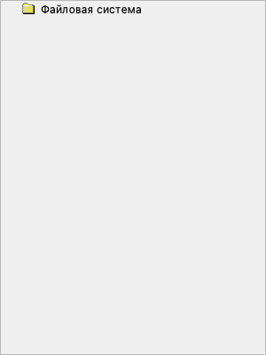 | [Light](files-light.png) |
| **Frame decode pane** `frame-decode-pane.png` | 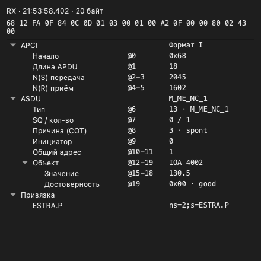 | [Light](frame-decode-pane-light.png) |
| **Graph cursor** `graph-cursor.png` |  | [Light](graph-cursor-light.png) [Manual](https://telecontrol-ru.github.io/scada/en/client/graph/) |
| **Hardware tree** `hardware-tree.png` | 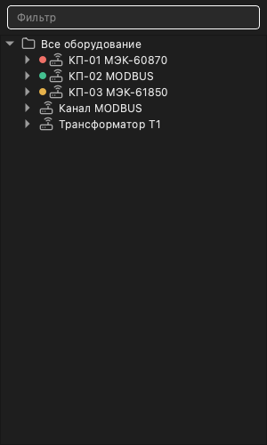 | [Light](hardware-tree-light.png) [Manual](https://telecontrol-ru.github.io/scada/en/client/) |
| **Inspector event** `inspector-event.png` | 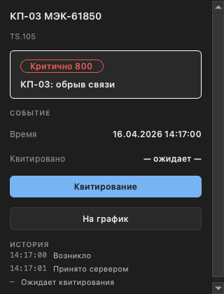 | [Light](inspector-event-light.png) [Manual](https://telecontrol-ru.github.io/scada/en/client/workbench/) |
| **Inspector panel** `inspector-panel.png` | 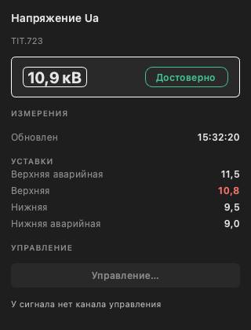 | [Light](inspector-panel-light.png) [Manual](https://telecontrol-ru.github.io/scada/en/client/workbench/) |
| **Limits chart** `limits-chart.png` | 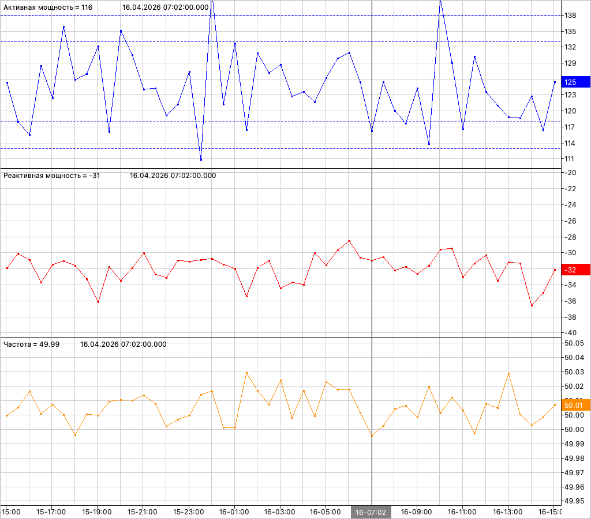 | [Light](limits-chart-light.png) [Manual](https://telecontrol-ru.github.io/scada/en/architecture/) |
| **Object tree** `object-tree.png` | 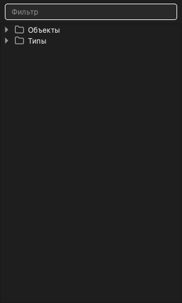 | [Light](object-tree-light.png) |
| **Pages** `pages.png` | 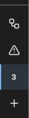 | [Light](pages-light.png) |
| **Parameters** `parameters.png` | 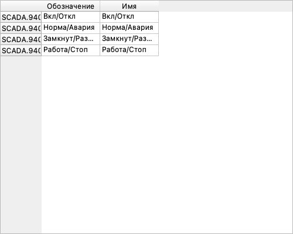 | [Light](parameters-light.png) |
| **Password policy** `password-policy.png` | 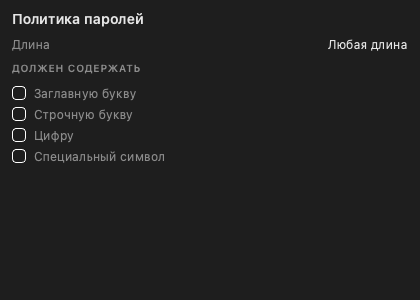 | [Light](password-policy-light.png) |
| **Portfolio** `portfolio.png` | 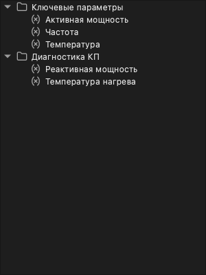 | [Light](portfolio-light.png) |
| **Rail utilities** `rail-utilities.png` | 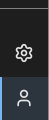 | [Light](rail-utilities-light.png) |
| **Roles** `roles.png` | 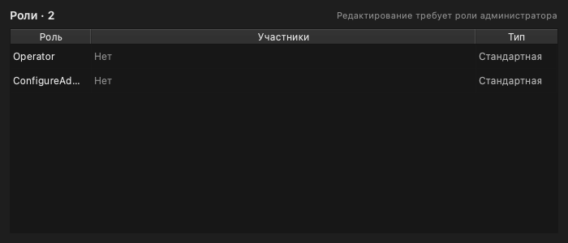 | [Light](roles-light.png) |
| **Series inspector** `series-inspector.png` | 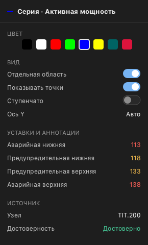 | [Light](series-inspector-light.png) |
| **Severity tiles** `severity-tiles.png` | 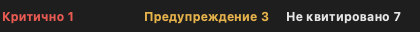 | [Light](severity-tiles-light.png) |
| **Sheet** `sheet.png` | 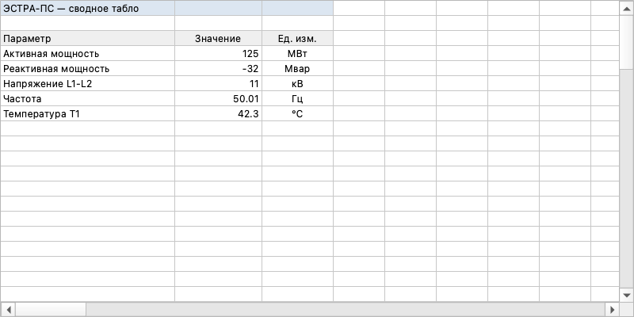 | [Light](sheet-light.png) |
| **Substation display** `substation-display.png` |  | [Light](substation-display-light.png) [Manual](https://telecontrol-ru.github.io/scada/en/client/workbench/) |
| **Summary** `summary.png` | 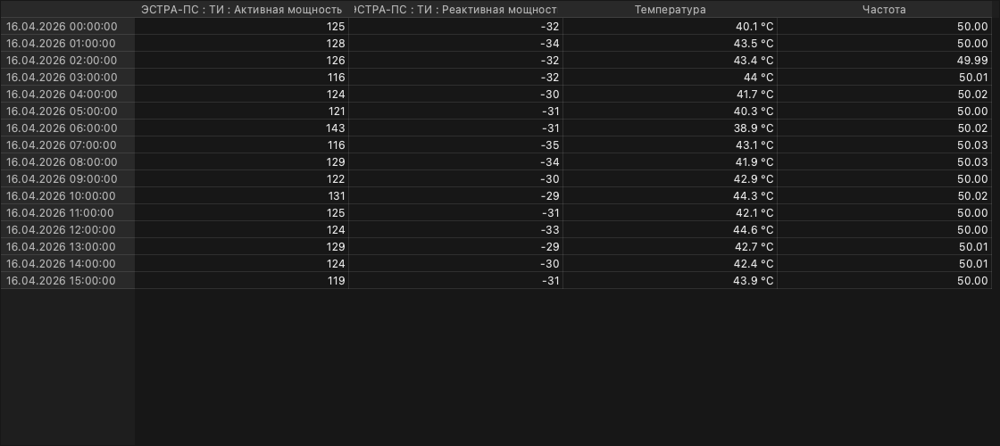 | [Light](summary-light.png) |
| **Table workspace** `table-workspace.png` | 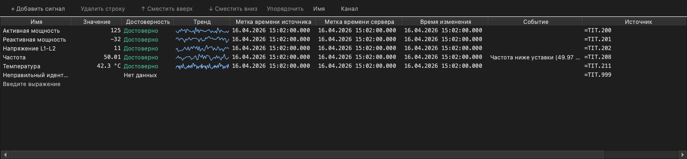 | [Light](table-workspace-light.png) [Manual](https://telecontrol-ru.github.io/scada/en/client/workbench/) |
| **Table** `table.png` | 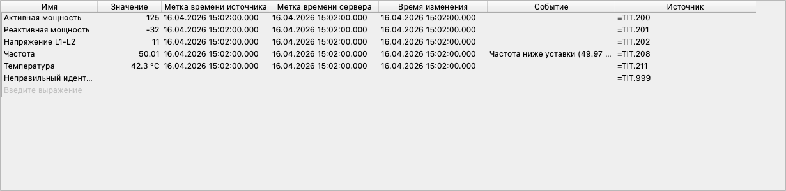 | [Light](table-light.png) |
| **Transmission rule** `transmission-rule.png` | 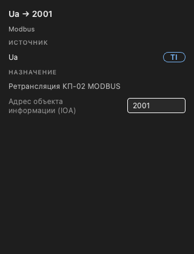 | [Light](transmission-rule-light.png) [Manual](https://telecontrol-ru.github.io/scada/en/client/workbench/) |
| **Users admin** `users-admin.png` | 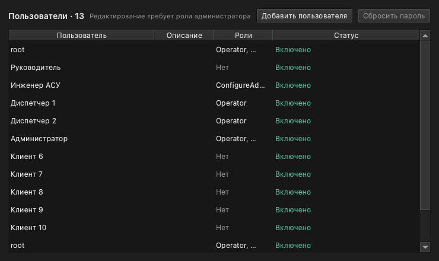 | [Light](users-admin-light.png) |
| **Users rbac** `users-rbac.png` | 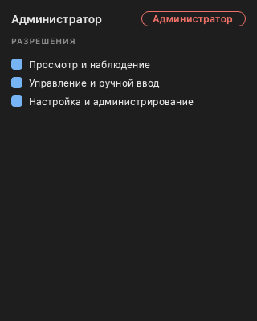 | [Light](users-rbac-light.png) |
| **Users** `users.png` | 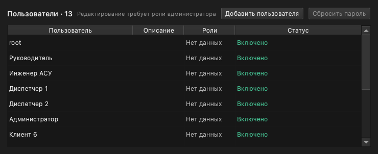 | [Light](users-light.png) [Manual](https://telecontrol-ru.github.io/scada/en/dev/users/) |
| **Watch filter bar** `watch-filter-bar.png` | 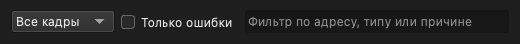 | [Light](watch-filter-bar-light.png) |
| **Workbench activity rail** `workbench-activity-rail.png` | 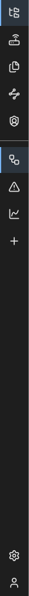 | [Light](workbench-activity-rail-light.png) [Manual](https://telecontrol-ru.github.io/scada/en/client/workbench/) |
| **Workbench overview** `workbench-overview.png` | 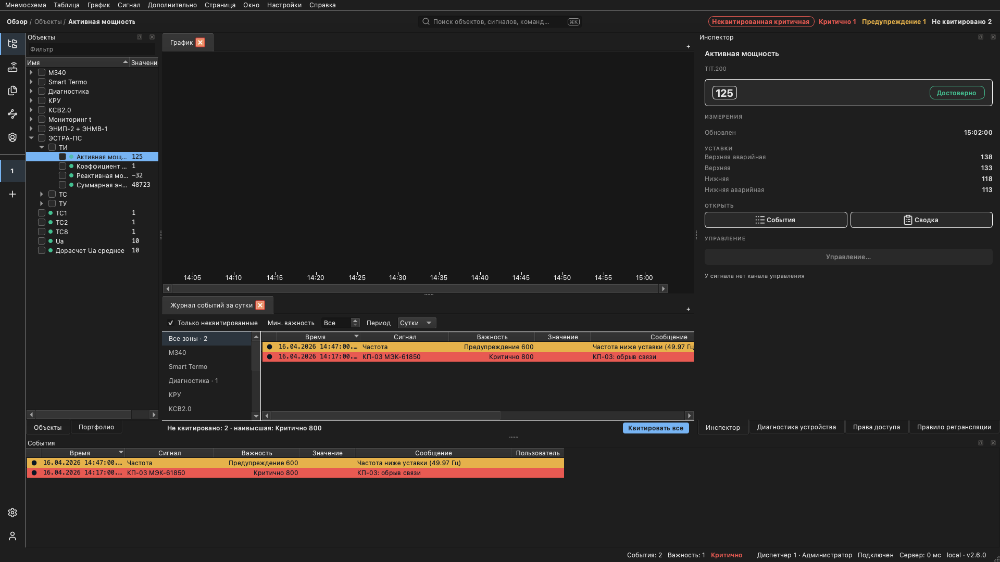 | [Light](workbench-overview-light.png) [Manual](https://telecontrol-ru.github.io/scada/en/client/workbench/) |
| **Workbench window** `workbench-window.png` |  | [Light](workbench-window-light.png) [Manual](https://telecontrol-ru.github.io/scada/en/client/workbench/) |

## Dialogs

Modal and overlay surfaces. (20)

| Capture | Preview | |
|---|---|---|
| **About** `about.png` | 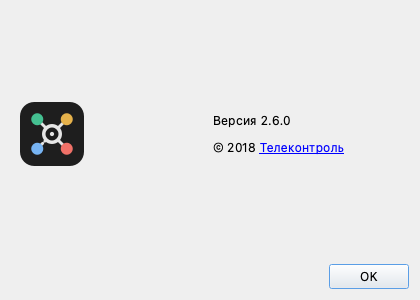 | [Light](about-light.png) |
| **Change password** `change-password.png` | 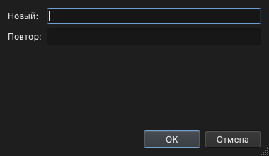 | [Light](change-password-light.png) |
| **Client login** `client-login.png` | 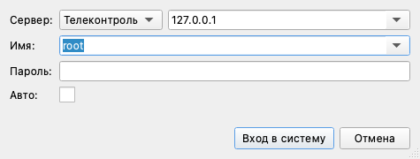 | [Light](client-login-light.png) [Manual](https://telecontrol-ru.github.io/scada/en/getting-started/) |
| **Command palette** `command-palette.png` | 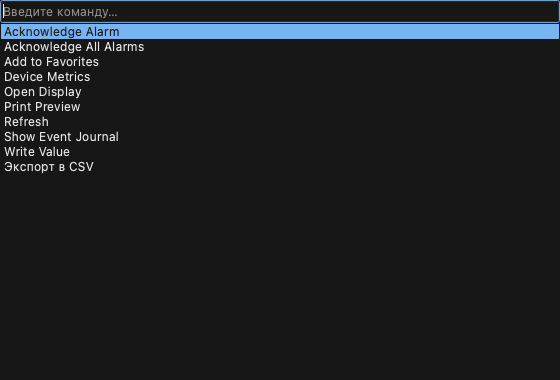 | [Light](command-palette-light.png) [Manual](https://telecontrol-ru.github.io/scada/en/client/workbench/) |
| **Control select confirm** `control-select-confirm.png` | 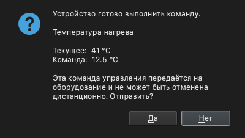 | [Light](control-select-confirm-light.png) [Manual](https://telecontrol-ru.github.io/scada/en/client/) |
| **Limits** `limits.png` | 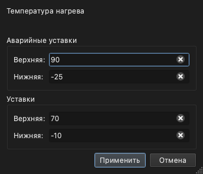 | [Light](limits-light.png) [Manual](https://telecontrol-ru.github.io/scada/en/architecture/) |
| **Menu create object service** `menu-create-object-service.png` |  | [Light](menu-create-object-service-light.png) [Manual](https://telecontrol-ru.github.io/scada/en/dev/data-items/) |
| **Message box** `message-box.png` |  | [Light](message-box-light.png) |
| **Multi create** `multi-create.png` |  | [Light](multi-create-light.png) |
| **Settings** `settings.png` |  | [Light](settings-light.png) [Manual](https://telecontrol-ru.github.io/scada/en/client/workbench/) |
| **Ti manual control** `ti-manual-control.png` |  | [Light](ti-manual-control-light.png) [Manual](https://telecontrol-ru.github.io/scada/en/client/) |
| **Ti remote control confirm** `ti-remote-control-confirm.png` |  | [Light](ti-remote-control-confirm-light.png) [Manual](https://telecontrol-ru.github.io/scada/en/client/) |
| **Ti remote control disabled** `ti-remote-control-disabled.png` |  | [Light](ti-remote-control-disabled-light.png) [Manual](https://telecontrol-ru.github.io/scada/en/client/) |
| **Ti remote control enabled** `ti-remote-control-enabled.png` |  | [Light](ti-remote-control-enabled-light.png) [Manual](https://telecontrol-ru.github.io/scada/en/client/) |
| **Time range** `time-range.png` |  | [Light](time-range-light.png) |
| **Ts manual control** `ts-manual-control.png` |  | [Light](ts-manual-control-light.png) [Manual](https://telecontrol-ru.github.io/scada/en/client/) |
| **Ts remote control confirm** `ts-remote-control-confirm.png` |  | [Light](ts-remote-control-confirm-light.png) [Manual](https://telecontrol-ru.github.io/scada/en/client/) |
| **Ts remote control disabled** `ts-remote-control-disabled.png` |  | [Light](ts-remote-control-disabled-light.png) [Manual](https://telecontrol-ru.github.io/scada/en/client/) |
| **Ts remote control enabled** `ts-remote-control-enabled.png` |  | [Light](ts-remote-control-enabled-light.png) [Manual](https://telecontrol-ru.github.io/scada/en/client/) |
| **Workbench login** `workbench-login.png` |  | [Light](workbench-login-light.png) [Manual](https://telecontrol-ru.github.io/scada/en/client/workbench/) |

## Menus

Menus and context menus, captured open. (2)

| Capture | Preview | |
|---|---|---|
| **Menu excel** `menu-excel.png` |  | [Light](menu-excel-light.png) [Manual](https://telecontrol-ru.github.io/scada/en/dev/excel/) |
| **Menu summary** `menu-summary.png` |  | [Light](menu-summary-light.png) [Manual](https://telecontrol-ru.github.io/scada/en/client/summary/) |

## Reading a diff

Every row in the manifest records the commit and host platform it was captured on. Offscreen Qt rasterizes with the host's fonts, so **a changed image whose `platform` also changed is churn, and a changed image on the same platform is a UI change**.
